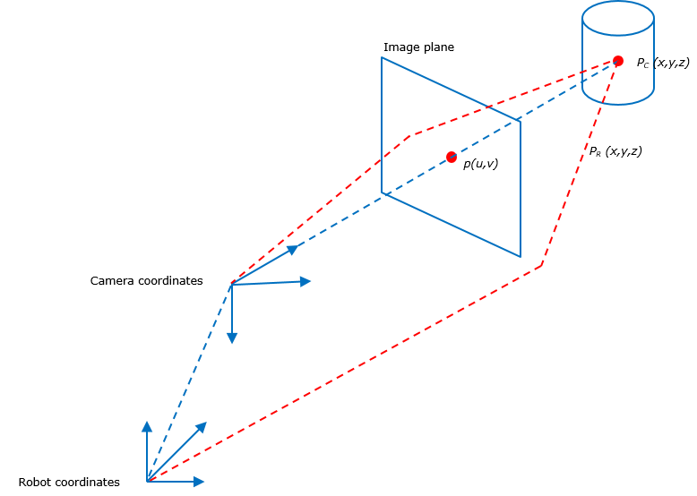
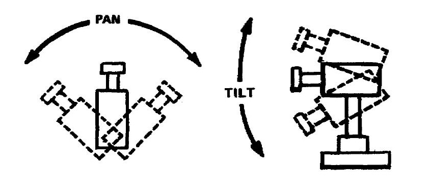

# Tutorials for the course "First Steps in Programming a Humanoid AI Robot"


## Gretchen API and Program Skeletton

Gretchen's Python bindings abstract the camera and the robot as Python classes. If you want to access the camera, you need to instantiate the Camera() class. Similarly, if you plan to move Gretchen's actuators, you will instantiate the Robot() class.

The following program shows Gretchen Python skeletton that can be used as a starting point for your programs.
```Python
#!/usr/bin/env python3
#
# First Steps in Programming a Humanoid AI Robot
#
# Short program description.
# 


# Import required modules
import cv2
import sys
sys.path.append('..')
from lib.camera_v2 import Camera
from lib.robot import Robot
from lib.ros_environment import ROSEnvironment


# Create camera & robot
camera = Camera()
robot = Robot()


# Method executed on click in camera image
def onMouse(event, u, v, flags, param):
    # If left button is clicked...
    if event == cv2.EVENT_LBUTTONDOWN:
        # Do something


def main():
    # Initalize ROS environment, start robot and camera
    ROSEnvironment()
    robot.start()
    camera.start()

    # Create a window called "Frame" and install a mouse handler
    cv2.namedWindow("Frame")
    cv2.setMouseCallback("Frame", onMouse)

    # Loop
    while True:
        # Get image from camera
        img = camera.getImage()

        # Do something

        # Use OpenCV to show camera image the window named "Frame"
        cv2.imshow("Frame", img[...,::-1])

        # Exit loop if key was pressed
        key = cv2.waitKey(1)
        if key > 0:
            break


#
# Program entry point when started directly
#
if __name__ == '__main__':
    main()
```

## The Gretchen Camera() Class

The Gretchen Camera() class provides a function to retrieve the current image and methods to convert 2-d and 3-d points between different coordinate systems.

| API | Description |
|:----|:------------|
| `c = Camera()` | Constructor. Instantiates a Camera() object. |
| `c.start()` | Start the camera. |
| `img = c.getImage()` | Retrieve the current image from the camera. Individual pixel values can be accessed at coordinates (u,v) with `img[v,u]`. |
| `(x,y,z) = c.convert2d_3d(u,v)` | Convert image point (u,v) into a 3-d point in the camera frame. Always sets z to 1 meter. |
| `(u,v) = c.convert3d_2d(x,y,z)` | Convert a 3-d point in the camera frame into a 2-d image point. |
| `(x,y,z) = c.convert3d_3d(x,y,z)` | Transforms a 3-d coordinate in the camera frame into the robot frame. |




## The Gretchen Robot() Class

The Gretchen Robot() class provides a "turtle API" to center, move left, right, up, or down Gretchens head. A low-level interface allows directly setting the pan and tilt angles of the motors. A high-level function allows the user to specify a 3-d point in the robot's coordinate frame and move the motors such that Gretchen "looks" directly at the point.

| API | Description |
|:----|:------------|
| `r = Robot()` | Constructor. Instantiates a Robot() object. |
| `r.start()` | Start the robot. |
| `r.center()` | Center Gretchen's head (pan=tilt=0 radians). |
| `r.up(rad) / r.down(rad)` | Tilt Gretchen's head up or down by `rad` radians relative to the current position. |
| `r.left(rad) / r.right(rad)` | Pan Gretchen's head left or right by `rad` radians relative to the current position. |
| `r.move(pan, tilt)` | Pan/tilt Gretchen's head to the absolute actuator position given by `pan` and `tilt`. |
| `r.lookatpoint(x,y,z, velocity=10.8)` | Sets pan/tilt such that Gretchen "looks at" the 3-d point in the robot's coordinate frame. The speed of the movement can be controlled by the parameter `velocity`. |


